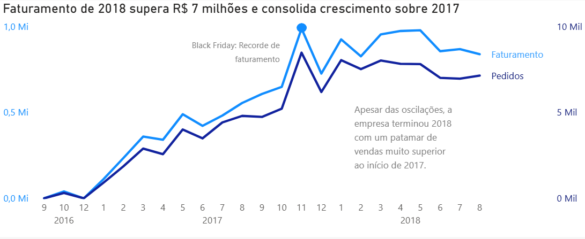
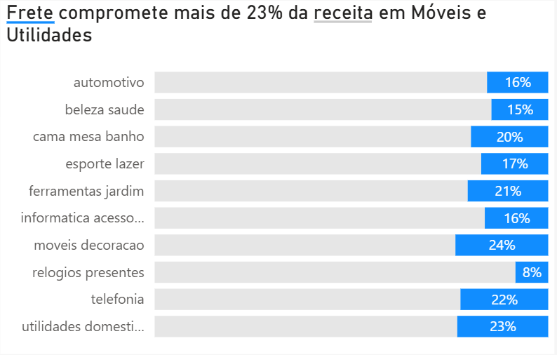
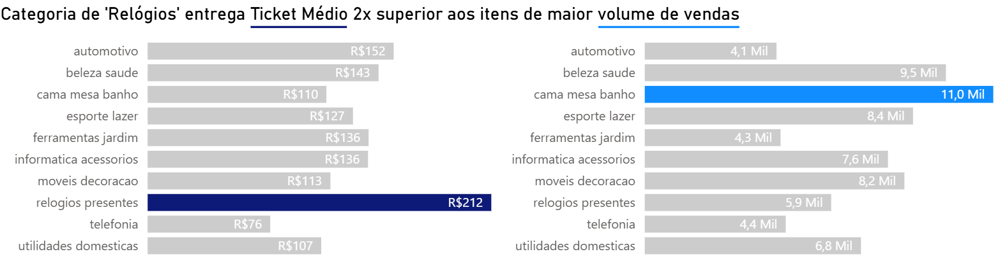

# Análise Exploratória de Dados para E-Commerce - Marketplace digital

# Sumário Executivo

Utilizando SQL e Power BI, foram extraídas informações sobre faturamento, concentração de vendas regionais, lucratividade, e sazonalidade para identificar padrões de venda e oportunidades de crescimento. Após verificar um crescimento contínuo no faturamento e volume de vendas da empresa ao longo de 2017 e 2018, analisou-se o seguinte: (I) há uma divergência entre alto ticket médio de algumas categorias vs alto volume de vendas de categorias com ticket médio mais baixo, (II) região Sudeste como a principal consumidora dos produtos da empresa e (III) o valor do frete pode influenciar a expansão das vendas nas demais regiões do país. Visando aumentar a receita e a presença da empresa em mais estados brasileiros, é recomendado: 

I. Acionar produtos com alto ticket médio para campanhas de marketing.

II. Avaliar o custo de oportunidade para expansão da presença da marca.

III. Testar estratégias de otimização de frete para regiões em potencial.

# O Problema de Negócio

7 em cada 10 consumidores brasileiros compraram online mensalmente em 2025 (CNDL/SPC), consolidando o e-commerce como um canal de compras competitivo e indispensável. Diante essas informações, este projeto busca analisar gargalos operacionais e oportunidades de crescimento em uma empresa de marketplace digital através da análise exploratória de dados, visando identificar:

- Quais são os picos de demanda e tendências temporais de crescimento?
- Quais são os produtos mais vendidos e qual o Ticket Médio por categoria?
- Quais categorias possuem alto volume, mas baixa rentabilidade devido à logística?
- Como o custo do frete impacta a margem em diferentes produtos?
- Como as vendas estão distribuídas por estado?

# Estrutura do Repositório

- /scripts: Queries SQL para modelagem e criação da view vendas_gerais.
- /pbix: Arquivo do Power BI com dashboard interativo.
- /img: Captura de tela do dashboard para visualização rápida.

OBS: Devido ao volume dos arquivos, a base de dados bruta não foi incluída neste repositório. Os dados originais são públicos e podem ser acessados [via Kaggle](https://www.kaggle.com/datasets/olistbr/brazilian-ecommerce) (plataforma que contém os dados).

# Metodologia

- Extração: Conexão com as tabelas originais do Kaggle via SQL Server.
- Transformação (SQL): Padronização de valores, tratamento de datas e criação de uma View unificada.
- Carga e Modelagem (Power BI): Importação da View e criação do modelo estrela (Star Schema) para otimização de performance - processo de ETL automatizado via Power Query.

# Habilidades

SQL: CTEs, subqueries, Joins, Views e funções de agregação.

Power BI: Dax, ETL, visualização e modelagem de dados.

# Resultados & Recomendações de Negócio

Criar um dashboard para acompanhar as vendas de e-commerce dá aos stakeholders de operações e finanças visibilidade sobre otimização de custos logísticos e rentabilidade por categoria. Ao iniciar a análise pelo estudo de aspectos sazonais, identificou-se um crescimento contínuo de faturamento e pedidos a partir de janeiro de 2017, atingindo seu maior pico na Black Friday do mesmo ano. Esta ascensão é consolidada em 2018, quando a empresa atinge um patamar de vendas superior ao de 2017, mantendo-se estável na maior parte do ano. Abaixo, será aprofundada a análise sobre “o que” está sendo vendido e em qual volume, “quanto” cada categoria contribui para o negócio e “onde” estão os principais compradores. 

  

O volume de vendas por categoria indica que os artigos mais vendidos não são os mesmos que detêm o maior ticket médio, o que pode influenciar diretamente as estratégias de mix de produtos e a estratégia financeira da empresa. 

  

Além disso, os produtos com maior ticket médio figuram entre aqueles que possuem os menores fretes - fator que representa o maior custo logístico do e-commerce - e produtos com baixo ticket médio tendem a ter fretes maiores, mesmo que representem um faturamento total alto e quantidade de pedidos relevante, como é o caso da categoria “eletronicos”, o qual figura em 8º lugar da lista com os fretes mais elevados. 

  

Ao analisar a distribuição geográfica das vendas, a região Sudeste está no topo do ranking: SP lidera com 41%, RJ com 12% e MG com 11%. Juntos, detêm 64% das vendas, mais da metade. Destaca-se que essa região é a mais populosa, urbanizada e rica do país, concentrando a maior parte da população e da economia. Como esperado, estes também detêm a maior soma de fretes totais, representando 55% da fatia. É válido mencionar, porém, que os estados de RS, PR, SC e BA concentram uma porcentagem mais alta de frete somado (19%) do que de vendas realizadas (16%). Sendo assim, recomenda-se analisar se uma redução no custo do frete pode significar um aumento das vendas para o faturamento advindo dessas regiões, levando em consideração o custo de oportunidade, uma vez que possuem uma população economicamente ativa de 23,19 milhões de pessoas, segundo dados da PEA (População Economicamente Ativa).

Diante os dados apresentados, recomenda-se: 

1. Intensificar os esforços operacionais e de marketing na Black Friday, focando em produtos que detêm maior volume de vendas e ticket médio, como as categorias de “cama, mesa e banho”, “beleza e saúde”, “esporte e lazer” e “relógios”.  
2. Estudar o custo de oportunidade para elevar o número de pedidos nas demais regiões do país, principalmente RS, PR, SC e BA, os quais possuem grande mercado consumidor ativo, mas alto índice de frete para envio.
3. Investir no marketing para prospecção inbound em produtos que detêm o maior ticket médio para os estados mencionados no ponto 2 como forma de diluir as perdas com o frete e atingir um novo mercado.

# Próximos Passos

1. Regressão e séries temporais para fazer previsão.
2. Pesquisa de mercado para escalabilidade do negócio nos estados de RS, PR, SC e BA.
